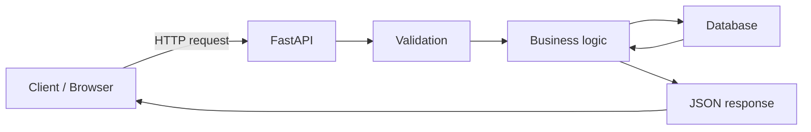

# Python, APIs and software fundamentals

First principle: software is a repeatable transformation of inputs into outputs.

Learn:
- Python functions, data structures, classes, exceptions and modules.
- JSON serialization and validation with Pydantic.
- HTTP methods, status codes, headers, authentication and REST APIs.
- Git, branches, commits, pull requests and environment variables.
- Unit tests, integration tests, logging and debugging.
- Basic command-line operations and Linux processes.

Understand the architecture:

Build a small CLI tool using Python that:
- Reads a JSON file.
- Calls an external API with authentication.
- Transforms and validates the response using Pydantic.
- Logs errors and successful outputs.
- Is controlled via environment variables.
- Uses type hints and unit tests.
- Runs in a Docker container.

Hands-on lab: 

- build a FastAPI service for managing support tickets. 
- It should validate input, store tickets in PostgreSQL, handle errors, and expose create, read, update and list endpoints.

Acceptance criteria:

- Invalid input returns a clear validation error.
- Data persists after restarting the application.
- Tests cover successful and unsuccessful requests.
- API credentials are not hardcoded into source code.